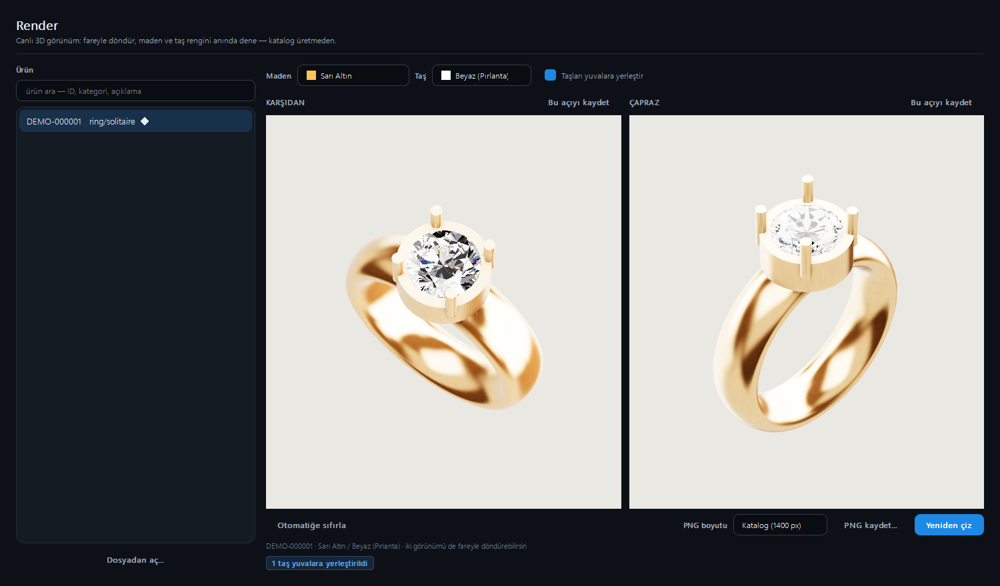

# Catalog Organizer

**Local-first catalogue tool for jewellery CAD files (`.3dm` / `.stl`).**
Scan an archive, measure every piece, classify it with a vision model, price it, write
Etsy / WooCommerce listings, and look at it in a live 3D viewer that also draws the images of your
PDF catalogue.

[](LICENSE)


🇹🇷 **Türkçe:** [README.tr.md](README.tr.md) · [Kullanım kılavuzu (talimatname)](docs/KULLANIM_KILAVUZU.md)



*The Render tab, showing the bundled demo ring: the two views a catalogue page prints, side by side,
each one a live 3D player. The stone was placed in the ring's empty seat automatically.*

---

## What it does

| | |
|---|---|
| **Analyze** | Geometry only, no AI needed. Dimensions, ring bore, metal weights for eight alloys (net, sprue, final), stone sizes / counts / carats, sprue (casting stem) detection. Works on a single file or a whole folder; exports CSV. |
| **Process** | Runs the full pipeline over a folder of CAD files: snapshots → vision-model classification and tags → measurements → catalogue record. Pause, resume, cancel; writes a CSV. |
| **Search** | Filter the catalogue by category, sub-category, stone status, brand, sprue; free-text over tags and descriptions. Entirely in memory, instant at tens of thousands of records. |
| **Publish** | Build selection lists, generate listing copy with a text model, compute prices from your own formulas, export **Etsy** and **WooCommerce** CSVs, and write a **PDF catalogue** (two views per page). |
| **Render** | A live 3D player (Chromium + three.js, embedded). Try metals and stone colours instantly, orbit freely, save an angle as the catalogue view. The same engine draws the PDF images. |
| **Diagnostics / Settings / Logs** | Run each pipeline stage on its own and time it; pick the model provider and edit prices; tail the audit log. |

It is built for a jewellery workshop that has hundreds of thousands of CAD files and needs to know
*what is in the archive* before it can sell any of it.

## Highlights

* **Local by default.** The default vision model runs on your machine through
  [Ollama](https://ollama.com). Cloud providers (OpenAI, MiniMax, GLM, OpenCode Zen, any
  OpenAI-compatible endpoint) are optional; their keys live in the operating system's credential
  store, never in a file. There is no telemetry. Images leave your computer only for the provider
  you chose.
* **A real render engine, not a screenshot.** Stones are ray-traced analytically against their own
  facet planes (with dispersion and per-colour absorption), metal gets baked per-vertex ambient
  occlusion, and everything is tone-mapped once, the way a retail product viewer does it. See
  [docs/RENDER_ENGINE.md](docs/RENDER_ENGINE.md).
* **Consistent photography.** Every product of one category is shot from the same angle; rings are
  turned to show the head, flat pieces face the camera. Hand-picked angles are stored per piece.
* **Weights you can reason about.** Boolean-union volumes (overlapping solids are not counted
  twice), exact cutter subtraction when Rhino is available, a documented heuristic when it is not.
* **STL honesty.** An STL is a piece *before* the machine: it has no stones, only the seats cut for
  them. The app can detect those seats and place stones in them, but only for products you (or the
  catalogue record) say have stones, and it labels the result as an estimate. A `.3dm` carries its
  stones in a layer and needs no guessing. See [the user guide](docs/USER_GUIDE.md#stl-or-3dm).

## Quick start (Windows)

You need **Python 3.11 or 3.12** and a GPU that supports **WebGL 2** (any recent one).

```powershell
git clone https://github.com/emrekaandrms/catalog-organizer.git
cd catalog-organizer
py -3.12 -m venv .venv
.venv\Scripts\activate
pip install -e .
python -m catalog_organizer.app
```

Try it without any CAD files of your own: in the **Render** tab press **Dosyadan aç…** ("Open
file…") and choose [`examples/demo_ring.stl`](examples/README.md), a rights-free ring generated by
[`examples/make_demo_ring.py`](examples/make_demo_ring.py). Tick **Taşları yuvalara yerleştir**
("Place stones in the seats") and the empty seat gets a stone.

For the AI classification steps install [Ollama](https://ollama.com) and pull the default model:

```powershell
ollama pull qwen3.5:9b-q4_K_M
```

Full instructions, optional Rhino support and troubleshooting: [docs/INSTALL.md](docs/INSTALL.md).

## Command line

```powershell
python -m catalog_organizer.app                                   # the GUI
python -m catalog_organizer.app analyze FILE [FILE ...] --csv out.csv   # geometry only, no AI
python -m catalog_organizer.app analyze --folder DIR --csv out.csv
python -m catalog_organizer.app run-pilot --n 5 --roots DIR        # headless pipeline on a few files
python -m catalog_organizer.app validate --truth truth.csv         # compare predictions to a truth CSV
python -m catalog_organizer.app webview ID [ID ...] --serve        # static three.js export of products
```

## Project layout

```
src/catalog_organizer/
  app.py            entry point and CLI
  gui/              PyQt6 panels (Dashboard, Analyze, Process, Search, Publish, Render, ...)
  scanner/          file discovery, hashing, manifest
  snapshotter/      .3dm / .stl loading and the snapshot images the vision model sees
  cad/              measurements, weights, stone extraction, stone seats, sprue, scale checks
  vlm/              model providers (Ollama, OpenAI, MiniMax, OpenAI-compatible), prompts, parsing
  orchestrator/     the pipeline, batch runner, geometric analysis
  catalog/          catalogue index, writer, search
  listing/          listing copy and pricing
  export/           Etsy / WooCommerce CSV, PDF catalogue
  render/           the VTK renderer (fallback), stone and metal optics, materials
  webview/          the web render engine: scenes, service, viewer assets (three.js, bundled)
  db/               SQLite catalogue, selections, listings, camera and render options
config/             categories, tags, prompts, prices, metal densities, stone weight tables
examples/           a rights-free demo ring and the script that makes it
tests/              the test suite
docs/               guides, architecture, render engine notes
```

## Development

```powershell
pip install -e ".[dev]"
pytest                          # the whole suite
set CATALOG_ORGANIZER_NO_GPU=1  # skip the tests that draw in the embedded Chromium
pytest
```

Tests that need private CAD files skip themselves when the files are absent. See
[CONTRIBUTING.md](CONTRIBUTING.md).

## Honest limits

* Developed and tested on **Windows 11**. Other platforms are untested.
* Weight, stone and carat figures are **estimates** calibrated on a small set of real files. Check
  them against a scale before you price anything.
* Stone placement in STL seats is a detector, not magic: it finds round, tapering, open seats and
  ignores everything else (pavé channels, perforated bands). Details in the user guide.
* The render engine needs a GPU with WebGL 2. There is a VTK fallback for scripts and tests, with a
  different look.

## License

**GPL-3.0-or-later**, see [LICENSE](LICENSE). The GUI is built on PyQt6, which is GPL v3 (or
commercially licensed from Riverbank); that is why this project is GPL too. Bundled and required
third-party software is listed in [docs/THIRD_PARTY_NOTICES.md](docs/THIRD_PARTY_NOTICES.md).

Etsy, WooCommerce, Rhino, MatrixGold, Qt and other names are trademarks of their owners. This
project is independent and is not affiliated with or endorsed by any of them.
